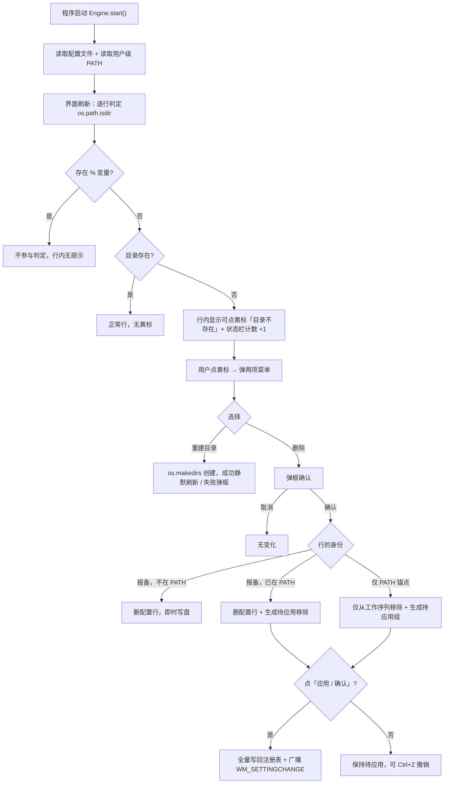
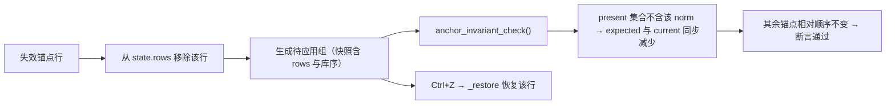

# 失效目录的行内重建与删除 · 功能设计报告

> **Feature Design · R8 失效目录行内处置 · v2.1 讨论稿**

目录存在性检查沿用现有口径，对判定为失效的行（报备项与锚点一视同仁）在行内给一个可点的黄标，点开就是「重建目录 / 删除」两项。不弹窗、不做汇总窗口、不做忽略机制；删除只移除声明，绝不删除磁盘上的任何文件。

| 项目 | 内容 |
| --- | --- |
| 目标平台 | Windows 桌面（沿用现状） |
| 关联主设计文档 | `design/Design Doc.md`（v0.8，仅用户级 PATH） |
| 关联实现 | `tool2path.py`（单文件，`__version__ = 2.0.0`） |
| 新增规则 | R8 失效目录行内处置 |
| 版本 | v2.1 · 讨论稿 |
| 日期 | 2026-09-15 |
| 状态 | 待评审，未开始编码 |

---

## 00 决策记录

以下 16 项在本轮问答中逐条定下，后续章节均以此为准。

| 议题 | 结论 | 主要理由 |
| --- | --- | --- |
| 失效锚点能否删除 | 可以，直接移除，不经过报备 | 目录已不存在，删掉不会让任何当前可用的命令失效；先报备会往配置文件先写一行再删一行，两次落盘还可能留下中间态 |
| 删除后的落盘方式 | 生成待应用变更，点「应用 / 确认」才写注册表 | 复用 R7 既有机制，待应用阶段可 `Ctrl+Z` 整组撤销 |
| 是否区分「不存在」与「未判定」 | 不区分，一律按失效处理 | 用户明确要求不提示原因；三态判定带来的额外认知成本不划算 |
| 含 `%VAR%` 的路径 | 沿用现有豁免，不参与判定 | 否则 `%USERPROFILE%\npm` 这类合法锚点会在每次刷新被报成失效 |
| 启动是否弹窗 | 不弹窗 | 由行内提示承担发现失效项的职责 |
| 是否做汇总窗口 | 不做 | 只做行内处置，避免两套入口 |
| 失效项的界面呈现 | 行内「目录不存在」黄标改为可点按钮 | 一眼可见、一下点到，比藏进右键菜单更易发现 |
| 菜单项构成 | 两项：重建目录 / 删除 | 与需求原文的两个选项一一对应 |
| 删除是否确认 | 弹框确认，全部失效项统一 | 仅库内的项即时写盘且无撤销，必须有这道确认 |
| 确认框是否强调锚点身份 | 不强调，与普通项统一文案 | 用户要求统一；靠「仅移除声明」这句把握住安全边界 |
| 重建失败与成功的反馈 | 失败弹错误框，成功静默刷新 | 与现有应用、移入等操作的反馈方式一致 |
| 重建的实现 | `os.makedirs(..., exist_ok=True)`，补齐多级父目录 | 目录被整条删掉时一次建回来 |
| 重建是否可撤销 | 不可撤销，也不进待应用 | 文件系统操作，与 PATH 声明无关 |
| 存在性何时重算 | 沿用现有刷新时机，不新增按钮 | 每次 `_refresh()` 本来就会重算，插拔盘后再点一次「重新载入配置」即可 |
| 状态栏失效计数 | 扩展到锚点 | 锚点失效此前完全不可见，计数含它才完整 |
| 目录后来恢复存在 | 不做任何自动处理 | 用户自己 `Ctrl+Z` 撤销；自动改待应用变更会破坏 R7 的既定基调 |

---

## 01 现状与缺口

程序已经有「目录缺失」的概念，但只做到提示，没做到处置。

`Toolchain.dir_missing` 的判定口径是：路径含 `%` 时返回 `False`（不展开变量），否则返回 `not os.path.isdir(...)`。左栏渲染时这个属性只换来一枚「目录不存在」的黄色角标；`PathRow` 的 `missing` 参数也只让行内文字变色。也就是说，一个失效目录可以在报备库里躺很久，既没有集中提示，也没有入口把它清掉。

三个真实场景让这个缺口变得明显：

- **工具链卸载后残留。** 卸载 Node、JDK 或某个 SDK 时目录被删掉，`registered-paths.yaml` 里的那一行还在，既不会被自动发现，还在影响报备库的条目列表。
- **换机换盘后目录没建。** 重装系统后 `C:\Python312\Scripts` 不存在，报备项点「移入」照样会写进 PATH，写进去的是一条指向空路径的死条目，而且这时没有任何反馈。
- **PATH 里的历史垃圾。** 早年的安装器往用户级 PATH 里写过一堆目录，卸载后条目仍在。它们因为不在配置文件里而属于只读锚点，界面上连点都点不动，用户只能进注册表或改用系统设置界面处理。

现状下用户得靠肉眼看黄标、手工开编辑器删行、再去别处处理 PATH，三处动作彼此脱节。这个功能把三处收敛到行内的一个按钮上。

## 02 需求定义与范围

**核心需求**：程序打开时扫描报备目录与 PATH 目录，对声明了却不存在于磁盘上的目录，提供重建与删除两个选项。

### 2.1 用户故事

| 编号 | 场景 | 说明 |
| --- | --- | --- |
| **US13** | 卸载残留清理 | 卸载了 Ruby，`D:\Ruby\bin` 已不存在。看到左栏该行的黄标，点开选「删除」，确认后配置文件立即少一行。 |
| **US14** | 换机后重建 | 重装系统后 `C:\Python312\Scripts` 没建。点黄标选「重建目录」，多级目录一次建好，黄标消失，报备项照旧可移入 PATH。 |
| **US15** | 死掉的 PATH 垃圾 | 右栏一条系统原有的 `C:\LegacyTools\bin` 已消失多年。点其黄标选「删除」，生成一条待应用变更，点「应用」后从 PATH 移除。 |
| **US16** | 报备项已在 PATH 中且失效 | 右栏该报备行的菜单第二项显示为「移出并删除报备」，一次动作同时完成 PATH 移除与配置文件清理。 |
| **US17** | 误判后反悔 | 删了一个失效锚点但还没点应用，随后意识到只是盘没插。用 `Ctrl+Z` 撤销那一组待应用变更即可。 |

### 2.2 非目标

不做以下事情，第一条是硬约束：

- 不删除磁盘上的任何文件或目录。删除一律指移除声明（配置文件行 / PATH 条目），程序不调用任何删除类文件系统接口。
- 不做启动弹窗、不做汇总列表窗口、不做忽略机制、不新增任何落盘文件。
- 不分类失效原因，不在界面上显示「盘符未挂载」「UNC 不可达」「访问被拒绝」之类的解释文案。
- 不做自动重建（没有「一键重建全部」），每一条都由用户点。
- 不检查目录内容，不校验可执行文件是否存在。
- 不巡检系统级（HKLM）PATH。
- 不改变 `registered-paths.yaml` 只存路径列表的既有约定（R0）。

## 03 判定口径

判定只有一问：这个目录现在在不在磁盘上。

1. 路径含 `%`：不参与判定，不提示。这条沿用 `Toolchain.dir_missing` 的现有实现，不是新加的保护。
2. 其余情况：`os.path.isdir(path)` 为真即正常，为假即失效。不区分盘符是否挂载、不区分网络路径是否可达、不区分是权限不足还是真不存在。
3. 目标路径上被同名文件占位（`os.path.isfile` 为真）也判为失效，重建时会因同名文件失败并给出提示，程序不会覆盖文件。

这个口径的代价是明确的：外接盘没插、网络盘掉线时，那条路径会被报成失效。用户在本轮问答中接受了这个代价，因此实现上不再加任何兜底判断。第 09 节把这条风险单独列出，方便日后回溯。

## 04 规则 R8 定义

> **R8 · 失效目录行内处置。** 对判定为失效的目录行，不论其身份是报备项还是锚点，行内提供「重建目录」与「删除」两个选项。重建只创建目录，删除只移除声明，两者都不触碰磁盘上的文件内容。删除一律先弹框确认，PATH 侧的移除一律进入待应用变更。

**R8.1 判定与呈现。** 按第 03 节口径判定；失效行在行内显示可点的「目录不存在」按钮。判定在每次界面刷新时重算，与现有刷新时机一致，不新增独立的检查按钮或定时器。

**R8.2 重建。** 用 `os.makedirs(path, exist_ok=True)` 创建目录及其多级父目录。成功即静默刷新界面，黄标消失；失败弹错误框并回显原因。重建是文件系统操作，不进待应用，也不可撤销。

**R8.3 删除。** 先弹框确认，确认后按行的身份分三种实现：

| 行的身份 | 菜单文案 | 实现 | 落盘时机 | 撤销 |
| --- | --- | --- | --- | --- |
| 失效报备，不在 PATH（左栏行） | 删除 | `Engine.delete_toolchain(tid)`，删配置行并即时写回文件 | 立即 | 无 |
| 失效报备，已在 PATH（右栏行） | 移出并删除报备 | `Engine.delete_toolchain(tid)`，删配置行 + 生成一组待应用移除 | 点「应用 / 确认」 | `Ctrl+Z` 整组撤销 |
| 失效锚点，仅 PATH（右栏行） | 删除 | 新增 `Engine.remove_missing_rows([uid])`，只从工作序列移除该行并生成待应用组 | 点「应用 / 确认」 | `Ctrl+Z` 撤销 |

**R8.4 锚点删除是 R1 / R2 的窄口径例外。** 这是软件唯一能改动锚点集合的地方，边界限定如下：只在目录已不存在时出现、只由用户点菜单触发、必须经过确认框、必须走待应用机制，实现上不经过「报备接管」。配置文件完全不动，用户不会因为一次删除而在报备库里多出条目。R2 的断言逻辑不需要改动：行被移除后不再出现在 `state.rows`，`anchor_invariant_check()` 的 `present` 集合自然不含它，其余锚点相对顺序不变，断言照旧通过。

**R8.5 不做的事。** 不提供跳过或忽略；不提供批量重建或批量删除入口；不提供命令行开关；不在探测到目录恢复存在时自动改动待应用变更。

确认框使用统一文案，不区分行的身份：

> 将从声明中移除「{name}」，路径 {entry_dir}。
> 仅移除声明，不会删除磁盘上的任何文件或目录。

右栏报备行的确认框额外补一句既有提示：若在应用前退出，该路径仍在 PATH 中，但已失去报备身份（变回锁定锚点）。

R8 与既有规则的关系，逐条核对后结论如下：

| 既有规则 | 结论 | 说明 |
| --- | --- | --- |
| R0 配置文件即报备库 | 一致 | 删报备项走既有 `delete_toolchain`，复用 `library.remove` + `save()`，头部注释照旧保留；删锚点不碰文件 |
| R1 白名单与接管 | 登记一处例外 | 见 R8.4。例外被限定在「目录不存在」的行上，且刻意不采用「先报备再删除」来绕过 |
| R2 锚点不变 | 断言逻辑不变 | 锚点集合本身被用户显式改动一次，其余锚点相对顺序不受影响，`anchor_invariant_check` 无需修改 |
| R3 库内自由排序 | 无影响 | 不涉及库序 |
| R4 组序不变 | 无影响 | 逐项独立处置，不构成批量组序操作 |
| R5 右栏拖动规则 | 无影响 | 不涉及拖拽 |
| R6 唯一性 | 一致 | 判定与处置均按 `norm_path` 归并 |
| R7 待应用与全量回写 | 一致 | PATH 侧移除全部进待应用；重建不进待应用 |

## 05 交互设计

失效行比正常行多一个可点按钮，其余部分的交互不变。

```
┌──────────────────────────────────────────────────────────────────────────────┐
│ 工具链 PATH 管理器            过滤 PATH：____  [⟳ 重新载入配置] [↻ 重读注册表] │
├──────────────────────────────┬──────────┬────────────────────────────────────┤
│ 我的报备库 · 未加入 3 项       │          │ 用户级 PATH                        │
│ ☐ ⠿ Go 1.22                  │  移入 →   │ [锚点] legacy                      │
│      D:\Go\bin               │          │        C:\LegacyTools\bin          │
│      [目录不存在 ▾]           │          │        [目录不存在 ▾]               │
│ ☐ ⠿ ruby                     │          │ [报备] nodejs                      │
│      D:\Ruby\bin             │   ← 移出  │        C:\Program Files\nodejs      │
│                              │          │ [报备] python                      │
│                              │          │        C:\Python312\Scripts        │
│                              │          │        [目录不存在 ▾]               │
├──────────────────────────────┴──────────┴────────────────────────────────────┤
│ 已选 0 项（左 0 + 右 0）  |  待应用 1 组 / 1 项  |  3 个目录不存在               │
│                                             [应用]  [确认]  [退出]             │
└──────────────────────────────────────────────────────────────────────────────┘
```

*图 1 · 失效项在左右栏都以可点黄标呈现。左栏的失效报备行不在 PATH 中，右栏的两行分别对应失效锚点与已加入 PATH 的失效报备。*

黄标点开后的菜单，内容随行的身份变化：

```
   报备项且不在 PATH        报备项且已在 PATH           失效锚点
   ┌──────────────┐        ┌──────────────────┐      ┌──────────────┐
   │ 重建目录      │        │ 重建目录          │      │ 重建目录      │
   │ 删除          │        │ 移出并删除报备     │      │ 删除          │
   └──────────────┘        └──────────────────┘      └──────────────┘
```

*图 2 · 三个分支只有第二项不同。第一项始终是重建目录。*

### 5.1 控件规格

| 控件 | 位置 | 行为 | 可用性约束 |
| --- | --- | --- | --- |
| 目录不存在（可点按钮） | 失效行的状态区 | 点开弹出两项菜单 | 仅失效行出现；非失效行不渲染 |
| 重建目录 | 行内菜单第一项 | `os.makedirs` 创建目录及多级父目录，成功后静默刷新 | 始终可用 |
| 删除 / 移出并删除报备 | 行内菜单第二项 | 弹框确认后按 R8.3 分支执行 | 写盘期间（`_applying`）全部禁用 |
| 状态栏失效计数 | 底栏 | 显示「N 个目录不存在」，含报备项与锚点 | 计数为 0 时不显示该段 |

### 5.2 与现有交互的衔接

- 黄标按钮所在的失效行，若本身是锚点，此前完全没有交互控件。本功能给它的只有这一个按钮，勾选框、拖拽手柄、`▲` `▼` 依旧不出现，锚点的其余只读属性不变。
- 左栏行原有的右键菜单（编辑 / 删除报备 / 移入）保持不变，不重复放重建与删除。
- 重建与删除成功后统一走现有 `_refresh()`，黄标消失、状态栏计数下降、左栏报备库计数同步更新。
- 写盘期间 `_set_mutation_enabled(False)` 会把菜单里的删除禁掉，重建因为不写注册表仍可执行。

## 06 关键流程

启动到行内处置的完整链路：



*图 3 · 失效目录从发现到处置。重建不进待应用；删除的 PATH 侧变更全部经由待应用落盘。*

锚点删除的断言安全性，可以单独看一遍：



*图 4 · 不修改断言逻辑即可安全移除失效锚点；撤销由既有 `_restore` 承担。*

## 07 数据模型与接口

不新增领域实体，只在引擎与行对象上补少量能力。

| 接口 | 位置 | 职责 |
| --- | --- | --- |
| `Toolchain.dir_missing` | 已有 | 报备项的失效判定，含 `%` 豁免，保持不动 |
| `Engine.row_missing(row) -> bool` | 新增 | 对任意行（含锚点）做失效判定，抽出 `_row_missing` 里对锚点返回 `False` 的限制。含 `%` 豁免 |
| `Engine.missing_rows() -> list[Row]` | 新增 | 当前工作序列中所有失效行，供状态栏与渲染共用 |
| `Engine.missing_count() -> int` | 新增 | 报备项（不在 PATH 的 + 在 PATH 的）与失效锚点的合计，替换 `_update_status` 里现有的两段拼接统计 |
| `Engine.rebuild_dir(path) -> OpResult` | 新增 | `os.makedirs(..., exist_ok=True)`，把 `OSError` 映射为可读文案；校验路径为绝对路径 |
| `Engine.remove_missing_rows(uids) -> OpResult` | 新增 | 仅对锚点行使用：从 `state.rows` 移除并 `_begin` / `_commit` 一组待应用变更，不碰配置文件 |

`delete_toolchain` 保持原样，右栏失效报备行直接调用它，因此「删配置行 + 生成移除」以及 `Ctrl+Z` 恢复报备记录与库序的能力全部复用现有实现。

GUI 侧改动：

| 位置 | 改动 |
| --- | --- |
| `LibraryRow` | 失效时把静态黄标换成 `QToolButton`，点击回调 `MainWindow._on_missing_menu("library", ident, pos)` |
| `PathRow` | 同样把黄标换成 `QToolButton`；锚点行只在失效时渲染该按钮 |
| `MainWindow._on_missing_menu` | 按行身份构造两项菜单，第二项文案随身份变化（删除 / 移出并删除报备） |
| `MainWindow._on_rebuild_dir` | 调 `engine.rebuild_dir`，失败走 `error()`，成功走 `_refresh()` |
| `MainWindow._on_delete_missing` | 弹确认框后按身份分派到 `delete_toolchain` 或 `remove_missing_rows` |
| `MainWindow._update_status` | 失效计数改用 `engine.missing_count()`，覆盖锚点 |

## 08 边界情况与规则冲突矩阵

| 边界场景 | 冲突点 | 既定行为 |
| --- | --- | --- |
| 路径含 `%VAR%` | 既有 `dir_missing` 约定 | 不参与判定，行内无任何提示，不提供处置 |
| 外接盘未插 / 网络盘掉线 | 误判风险 | 按失效处理，给出可点黄标，用户可能删掉暂时不可达的声明（已在第 09 节登记为已知代价） |
| 同名文件占位 | 重建失败 | 判为失效；重建时 `makedirs` 抛错，弹框提示同名文件已存在，程序不覆盖文件 |
| 多级父目录都不存在 | 重建范围 | `makedirs` 一次补齐全部层级 |
| 重建时权限不足 / 盘符不存在 | 操作失败 | `OSError` 被映射为可读文案，弹错误框，行保持失效 |
| 失效报备项不在 PATH | R0 | 删配置行即时写盘，无待应用、无撤销 |
| 失效报备项已在 PATH | R7 | 删配置行 + 生成待应用移除；`Ctrl+Z` 可整组撤销 |
| 失效锚点 | R1 / R2 | 直接在待应用层移除，不报备、不写配置文件；需弹框确认 |
| 删除后应用前退出 | R7 | 配置文件改动已即时保存；PATH 侧变更被放弃，两条路径各自回到原状 |
| 删了之后发现盘只是没插 | 无自动处理 | 若尚未应用，用户 `Ctrl+Z` 撤销；若已应用，需重新报备或在系统设置里加回 |
| 写盘期间点菜单 | R7 | 删除项被 `_set_mutation_enabled(False)` 禁用；重建仍可执行 |
| 同一目录在报备库与 PATH 中同时存在 | R6 | 按 `norm_path` 归并；左栏只展示未加入 PATH 的条目，因此该场景只会出现一行（右栏） |
| 界面刷新时目录恰好恢复存在 | 无 | 黄标自动消失，用户已生成的待应用变更不受影响 |
| 配置未加载的保护态 | R0 | 报备库为空，左栏无行；右栏锚点失效仍可重建与删除（不涉及配置文件） |

## 09 风险与权衡

| 风险 | 影响 | 缓解措施 |
| --- | --- | --- |
| 把「暂时不可达」当成「不存在」 | 用户删掉有效声明，尤其外接盘场景 | 用户明确选择不区分原因；删除必须弹框确认，PATH 侧改动仍可在待应用阶段 `Ctrl+Z` 撤销。这条风险在实现时不加兜底，登记在此供回溯 |
| 锚点可删削弱 R1 / R2 的直观印象 | 后续维护者可能误以为锚点全面可写 | R8.4 明确写下例外边界，并在主设计文档 R1 / R2 条目下加一条指针引用 |
| 用户以为删除会清理磁盘 | 预期落空 | 菜单文案用「删除」但确认框写明「仅移除声明，不会删除磁盘上的任何文件或目录」 |
| 用户以为重建能恢复工具链 | 目录建好但命令仍不可用 | 重建不额外提示（用户选择了不提示原因与轻反馈），靠 README 使用指南说明 |
| 失效项长期无人处理 | 死条目累积 | 状态栏常驻计数，行内黄标常驻可见；不做忽略机制，因此不会被静默掩盖 |
| 误点重建产生空目录 | 磁盘上多出空目录 | 重建目录本身无副作用，且不会覆盖已有内容 |
| 与应用流程的反馈风格不一致 | 用户体验割裂 | 沿用「失败弹框、成功静默刷新」，与现有 `_after_result` 风格保持一致 |

## 10 测试计划

沿用 README 的约定：用例补进 `tests/selftest.py`，使用临时目录与内存 `FakeRegistry`，不在测试中触碰真实 `HKCU`。

| 用例 | 断言要点 |
| --- | --- |
| 报备项失效判定 | 目录不存在时 `Toolchain.dir_missing` 为真；含 `%VAR%` 时为假 |
| 锚点失效判定 | `Engine.row_missing` 对失效锚点返回真（现有 `_row_missing` 返回假，是本功能的核心修改点） |
| 失效计数 | `missing_count()` 同时统计左栏失效报备、右栏失效报备与失效锚点 |
| 重建多级目录 | `rebuild_dir` 成功且目录真实存在；再次刷新该行黄标消失 |
| 重建失败 | 不存在的盘符返回 `ok=False`，消息非空，行仍为失效状态 |
| 同名文件占位 | `rebuild_dir` 返回失败，且不覆盖那个文件（文件内容不变） |
| 删除失效报备（不在 PATH） | 配置文件少一行，头部注释保留，库序不变，`pending_count()` 不变 |
| 删除失效报备（已在 PATH） | 生成 1 组待应用；`apply()` 后注册表值不再含该路径；`undo_group` 恢复报备记录与库序 |
| 删除失效锚点 | 生成 1 组待应用；配置文件内容逐字节不变；`anchor_invariant_check()` 无问题；`apply()` 后注册表值不再含该路径 |
| 锚点删除可撤销 | `undo_group` 后该行回到工作序列，位置与移除前一致 |
| 失效行不提供处置的兜底 | 非失效行不渲染黄标按钮；引擎侧直接对存在目录调用删除被拒 |
| 保护态下的行为 | 配置未加载时报备库为空，锚点侧重建与删除仍可用 |

## 11 实施计划

改动集中在 `tool2path.py` 与测试脚本，不新增文件、不新增依赖。

| 步骤 | 位置 | 内容 |
| --- | --- | --- |
| 1 | `Engine` | 补 `row_missing` / `missing_rows` / `missing_count`，抽出共用的 `%` 豁免判定 |
| 2 | `Engine` | 新增 `rebuild_dir` 与 `remove_missing_rows` |
| 3 | `LibraryRow` / `PathRow` | 黄标改为可点 `QToolButton`，接回调，锚点行只在失效时渲染该按钮 |
| 4 | `MainWindow` | 新增 `_on_missing_menu` / `_on_rebuild_dir` / `_on_delete_missing`；`_update_status` 改用 `missing_count()` |
| 5 | `tests/selftest.py` | 按第 10 节补用例 |
| 6 | 文档 | 主设计文档加 R8 与相关边界行；README 规则表加 R8、加 FAQ 一条、使用指南加一节 |

验收标准：左右栏失效行都出现可点黄标，点开是两项菜单；重建能补齐多级目录，失败有可读提示；三类删除各自落盘正确，删除锚点后 `anchor_invariant_check()` 无问题且 `Ctrl+Z` 能撤回；配置文件内容在删除锚点前后逐字节一致；`tests/selftest.py` 退出码为 0。

## 12 遗留问题

以下两项不影响开工，但建议在实现过程中顺带定下。

- **操作日志。** 主设计文档第 13 章提过「保留操作日志」，但代码里没有对应实现。本功能会改动锚点集合，属于值得留痕的操作。是否要加一份会话内的操作记录（内存态，随窗口关闭丢弃），需要在实现时确认。
- **界面文案的最后确认。** 菜单第一项定为「重建目录」，第二项在报备项场景下定为「移出并删除报备」，其余场景为「删除」。若你希望统一成「删除声明」这类更中性的表述，改起来只涉及文案常量。

## 13 对现有文档的修订清单

实现前需要同步落文档，避免规则表述分叉。

| 文档 | 位置 | 修订内容 |
| --- | --- | --- |
| 主设计文档 | 05 章业务规则 | 新增 5.8 节 R8 失效目录行内处置，含四条子规则与 R1/R2 例外的边界说明 |
| 主设计文档 | 05 章 R1 / R2 条目 | 各加一句指针，指向 R8.4 的窄口径例外 |
| 主设计文档 | 07 章功能需求 | 7.7 校验与状态提示一节改写：目录存在性软校验从「仅标黄」升级为「标黄可点 + 两项处置」，状态栏计数含锚点 |
| 主设计文档 | 08 章界面设计 | 关键控件规格表补入「目录不存在（可点）」与菜单两项 |
| 主设计文档 | 09 章交互流程 | 补入本文档图 3 的处置流程 |
| 主设计文档 | 12 章边界矩阵 | 补入本文档第 08 节的行，并改写「报备目录被移动 / 删除（失效）」那一行 |
| 主设计文档 | 14 章开放问题 | 登记第 09 节的已知代价（不区分失效原因）作为既定决策而非开放项 |
| README | 设计规则表 | 增加 R8 行，规则编号扩为 R0–R8 |
| README | 主要功能表 | 「目录软校验」一行改为「失效目录处置」，说明可重建可删除 |
| README | 使用指南 | 增加一节「失效目录的重建与删除」 |
| README | FAQ | Q9 改写，补充「点黄标可重建或删除，锚点也能删但要确认」 |
