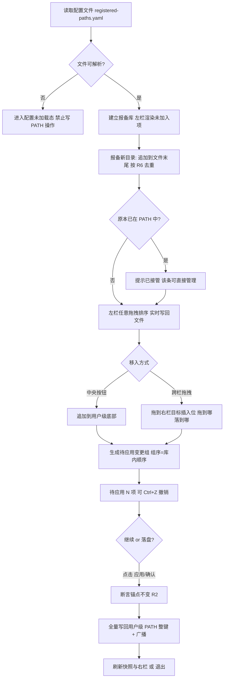
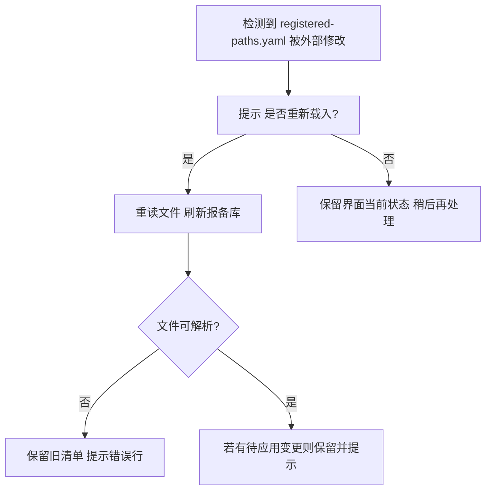
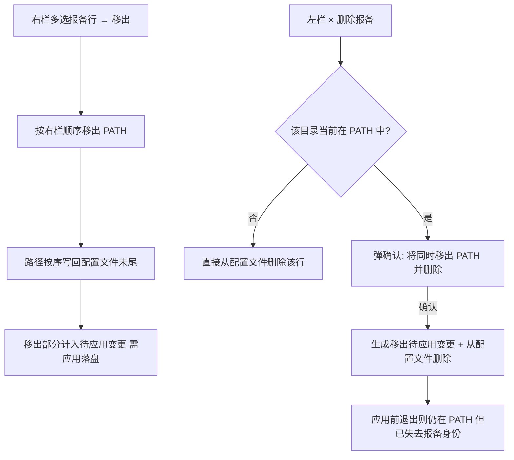
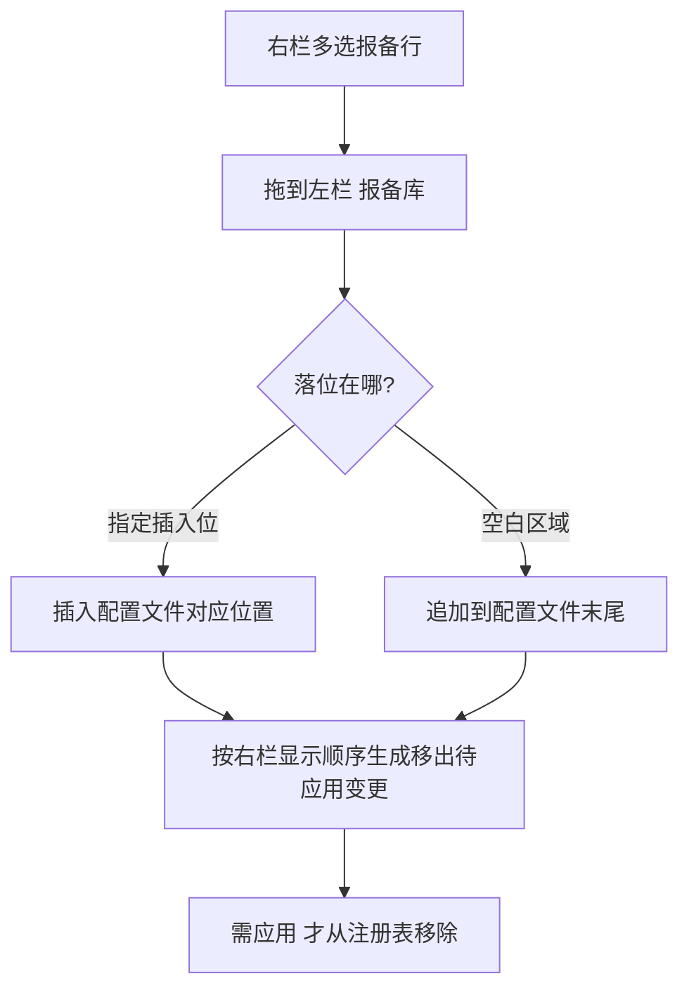
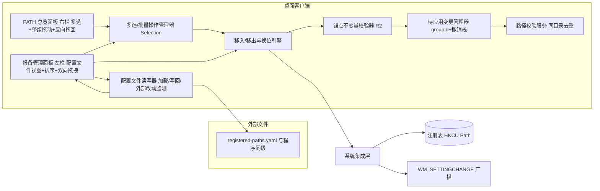

# 工具链 PATH 管理器 · 产品与设计文档

> **Product & Technical Design · v0.8 Draft**

把「工具链的可执行入口目录」统一报备到**一个与程序同级的外部配置文件**中：报备清单完全由该文件驱动（唯一事实源），软件只是它的可视化界面；右栏把报备路径放入用户级 PATH 的指定位置，左右栏均支持多选与批量操作（批量加入 / 移出 / 移动保持所选相对顺序），并在「非报备路径顺序永远不变」的前提下安全管理。

| 项目 | 内容 |
| --- | --- |
| 目标平台 | Windows 桌面 |
| 形态 | 原生 GUI + 外部配置文件驱动 |
| 版本 | v0.8 · 讨论稿（精简为仅用户级 PATH，支持双向跨栏拖拽） |
| 日期 | 2026-09-08 |

> **v0.8 修订要点（移除系统级 + 双向跨栏拖拽）**
> 1. **删除全部系统级（HKLM）PATH 相关**：不再管理系统级 PATH、不设系统级开关、不做跨层拖动、无分界线、无 UAC 提权。本软件**只管理用户级 PATH**，一次「应用」即可完成，普通权限即可写 `HKCU\Environment\Path`。
> 2. 因只剩用户级一层，原「层级 / level / needsElevation / 整组跨层」等概念全部移除，规则 R4、R5、R7 相应简化。
> 3. 其余沿用 v0.7 全部结论：报备库由与程序同级的 `registered-paths.yaml`（仅目录路径列表）驱动、配置文件为唯一事实源、报备即接管、移出回库尾、批量操作保持组序、撤销仅待应用阶段、外部 PATH 变更全量写回、× = 退出、同目录禁止重复、失效目录软校验标黄。
> 4. 新增**双向跨栏拖拽**：右栏报备行也可多选整组反向拖回左栏「报备库」即生成移出（拖回即移出，落插入位或追加文件末尾），锚点项不可拖。

---

## 01 概述与背景

开发、运维与数据工程师的机器上通常安装了大量工具链（Node、Python、JDK、Go、FFmpeg、Git、编译器、各类 CLI 框架等），每个工具链都带一个「可执行入口目录」。绝大多数场景下脚本来调用这些命令，依赖 **PATH 环境变量**决定解释器位置。

问题在于工具链数量多、入口目录五花八门，而系统只允许一份全局 PATH。于是出现两种常见应对：要么把全部目录一股脑塞进 PATH 造成冲突与污染；要么手动编辑注册表 / 环境变量，在「随时要切换工具链版本与启用与否」时非常痛苦。

本项目打算做一个桌面工具：所有工具链入口目录登记在**与程序本体同级的外部配置文件**里（纯路径列表，可手工编辑、可纳入版本管理）；GUI 采用**左（报备库 = 配置文件视图）— 中央（移入 / 移出）— 右（PATH 总览）**的三区布局。左栏条目可任意拖拽排序（写回文件行序）、多选批量移入，也可直接拖到右栏插入位「拖入即移入」；右栏展示**用户级 PATH**，其中系统原本就存在且**未登记在配置文件中**的路径是**只读锚点**（顺序固定不动），已登记路径可被多选并整组拖动落位，也可**反向拖回左栏「报备库」完成移出**。右栏改动先进「待应用变更」，由底部「应用 / 确认」全量写回注册表。

> **本设计文档**（v0.8 讨论稿）锁定：核心概念、业务规则、配置文件约定、功能需求、界面示意、数据模型、技术架构、场景流程与开放项，供实现前评审与迭代。

---

## 02 问题、目标与非目标

### 2.1 用户痛点

- **管理零散：** 工具链入口目录分布在安装目录、SDK 目录、本地 bin 等各处，缺乏统一登记视图。
- **切换困难：** 不同项目需要不同工具链版本 / 启用与否，手动改 PATH 既慢又易错，且往往是一组一组地切换。
- **配置不透明：** 希望工具链清单可读、可手动编辑、可随 dotfiles / 仓库走，而不是锁在私有数据库里。
- **误删误动风险：** 直接编辑 PATH 容易误删或误移系统原有关键路径，造成环境不可用。

### 2.2 目标

- ✅ 报备清单由**外部配置文件**驱动：与程序同级、内容仅为目录路径列表、可手工编辑、可版本管理。
- ✅ 配置文件是唯一事实源：GUI 只是可视化编辑器，界面增删改排全部写回文件。
- ✅ 左 / 中 / 右三区界面；左右栏均支持多选，可批量移入 / 移出 / 移动，批量操作保持所选相对顺序；支持**左↔右双向跨栏拖拽**（左拖右 = 移入，右拖左 = 移出）。
- ✅ 未报备路径是固定锚点：顺序永不变，不可排序、移动、删除、不可选；已登记路径可多选并整组拖动落位。
- ✅ 写回模型简单可靠：待应用变更集中预览，一次性全量写回用户级 PATH；待应用阶段可撤销。

### 2.3 非目标（本次不做）

- ❌ 不做通用「环境变量编辑器」，不接管 PATH 之外的其他系统/用户变量。
- ❌ 不做对非报备路径的任何排序 / 重排能力。
- ❌ 不做与外部 PATH 变更的自动合并 / 冲突协商。
- ❌ 不做远程 / 云端同步（配置文件本身可手工同步到其他机器）。
- ❌ 不做自动化探测「机器上已安装的所有工具链」——只管理配置文件里登记的项。
- ❌ **不做系统级（HKLM）PATH 管理**：不设系统级开关、不做跨层、无提权流程。

---

## 03 核心概念与术语表

| 术语 | 定义 | 举例 |
| --- | --- | --- |
| **工具链**（Toolchain） | 一个可独立启用的软件/解释器/框架集合 | Node.js、Python、JDK、Go、FFmpeg |
| **入口目录**（Entry dir） | 工具链存放可执行文件的目录，即要写入 PATH 的目录，也是配置文件中的每一行 | `C:\Program Files\nodejs` |
| **配置文件**（Registered file） | 与程序本体同级的报备清单文件（YAML / 纯文本数组），内容仅为路径列表，是报备库唯一事实源 | `registered-paths.yaml` |
| **报备**（Registered） | 把某入口目录写入配置文件即“报备”。报备即接管：原本已在 PATH 中的路径一经报备也变为可操作项 | 在文件中新增一行 |
| **报备库** | 配置文件所表示的路径清单；GUI 左栏为它的可视化视图，仅展示其中「未加入 PATH」的条目 | 左栏列表 |
| **库内排序** | 配置文件行的排列顺序；可任意拖拽重排并写回文件，与 PATH 生效顺序无关；也是批量移入的默认次序 | 左栏拖拽整理 |
| **多选**（Multi-select） | 在左栏或右栏内同时选中多条可操作项；锚点行不可选 | Ctrl / Shift / 勾选 / 框选 |
| **批量操作** | 对一组选中项执行一次统一动作（批量移入 / 移出 / 整组换位），组内保持相对顺序 | 多选后点「移入 →」 |
| **未报备路径 / 锚点**（Anchor） | PATH 中未登记在配置文件、系统原本就存在的路径。只读锚点：不可排序、移动、删除、多选 | System32、npm 全局 |
| **插入位**（Slot） | 锚点序列中的可插入空隙：最顶部、任意两个锚点之间、最底部；供右栏拖动与跨栏拖入落位 | 顶部 / 锚点间隙 / 底部 |
| **用户级 PATH（HKCU）** | 仅当前用户生效的 PATH，存储于 `HKCU\Environment\Path`，修改无需管理员；本软件唯一管理的层 | 右栏总览 |
| **移入**（Move-in） | 将报备项放入用户级 PATH 底部（中央按钮），或拖入右栏任意插入位（快捷拖拽） | 中央按钮「移入 →」/ 跨栏拖拽 |
| **移出**（Move-out） | 将右栏选中的报备项从 PATH 移除（按原顺序写回报备库文件末尾），仅报备项允许 | 中央按钮「← 移出」 |
| **拖入即移入** | 左栏条目直接拖到右栏某插入位（拖到哪落到哪）即生成移入 | 左→右跨栏拖拽 |
| **拖回即移出**（反向拖拽） | 右栏报备行直接拖回左栏「报备库」即生成移出：从 PATH 移除并写回配置文件（落到插入位或追加到文件末尾）；锚点不可拖 | 右→左跨栏拖拽 |
| **待应用变更**（Pending） | 尚未写回注册表的 PATH 改动集合（内存态），由「应用 / 确认」统一全量落盘；此阶段可用 Ctrl+Z 撤销 | 底部状态提示 |
| **锚点不变** | 软件自身任何操作不得改变未报备路径之间的相对顺序（剥离报备项后与最近一次读取的快照一致） | 任意操作前后 |

---

## 04 配置文件约定（唯一事实源）

> 本软件的“报备库”**不是私有数据库**，而是一个可读可编辑的外部文件。以下约定是全部设计的根基。

### 4.1 位置与形态

- 配置文件名为 `registered-paths.yaml`（纯文本，UTF-8），存放于**与程序可执行文件同级的目录**，便于用户随手打开编辑、随 dotfiles 一起走。
- 内容**仅为一个目录路径数组**：每行一个条目，支持注释行与空行；**不包含** id、名称、排序号、备注等任何其他字段。示例：

```yaml
# Toolchain Path Manager - 已报备的工具链入口目录
# 每一行 = 一个入口目录；顺序 = 报备库内顺序；可手工编辑后在本软件中重新载入
- C:\Program Files\nodejs
- C:\Python312\Scripts
- D:\Ruby\bin
```

### 4.2 唯一事实源与同步

> **规则 R0 · 配置文件即报备库。** 配置文件是报备库的**唯一事实源**：GUI 左栏只展示该文件内容；界面上「报备新条目 / 删除报备 / 库内拖拽排序 / 移出回库」都会**写回该文件**（保留“仅路径数组”结构，排序 = 重排行序），保证文件与界面始终一致。

- **启动时读取**配置文件，解析失败则提示并进入“未加载”态（不允许写 PATH 相关操作，避免基于错误清单覆盖注册表）。
- **手动「重新载入配置」**：任何时候可重新读取文件；若存在待应用变更，先提示“重载将保留待应用变更，仅刷新报备库”或先清空。
- **运行中外部改动提示**：监测文件修改时间 / 内容变化，发现被外部编辑器改动时提示「配置文件已被外部修改，是否重新载入？」，由用户决定，**不自动覆盖界面当前状态**（避免与用户的界面操作冲突）。
- GUI 写回文件时只重写路径列表区，尽量保留文件头部注释；若文件曾被外部手工加过注释 / 乱序，界面按“行序 = 库序”重新读入。

### 4.3 唯一性与显示名

- **同目录禁止重复报备**：配置文件内同一规范化路径只允许出现一次；GUI 写入时去重，手工写入的重复行在读取时标记为“重复（只显示一条）”。
- **显示名派生，不落盘**：界面显示名取目录最后一级（如 `nodejs`），同名条目以完整路径区分；配置文件中不含名称字段。

---

## 05 设计原则与核心业务规则

> 以下规则是整套交互的逻辑根基，任何新功能不得违反。

### 5.1 报备铁律：只有报备过才能删 / 移出 / 拖动 / 多选

> **规则 R1 · 白名单与接管。** 对 PATH 中某条路径执行「移出 / 删除 / 拖动换位 / 多选批量操作」，前提是它登记在本软件**配置文件**中。**报备即接管**：系统原有路径一经写入配置文件即转为可操作项；未报备的路径是只读锚点，**不可排序、不可移动、不可删除、不可选**。

- 配置文件就是「可操作白名单」的唯一来源。
- 报备原本已在 PATH 中的路径时，无需先移出再报备，直接显式接管（提示“该目录已在 PATH 中，报备后将可管理”）。
- 未报备条目不可勾选；即便程序内部收到指令也被拒绝，提示「锚点路径不可操作」。

### 5.2 锚点不变：未报备路径的顺序永远不动

> **规则 R2 · 锚点不变。** 未报备路径构成**固定锚点序列**，软件自身任何操作（含批量移入、移出、整组拖动、应用）都不得改变锚点之间的相对顺序。**剥离所有报备路径后，剩余序列必须与最近一次读取时的快照完全一致**，作为每次落盘前的自动断言。

- 报备路径只能落入锚点序列的插入位（顶部 / 任意锚点间隙 / 底部），不能把某个锚点“挤走”。
- 锚点快照在启动、手动「重读注册表」、每次成功应用后刷新；对外部 PATH 变更不做冲突协商（见 R6）。

### 5.3 报备库自由排序：左栏随便排，排序写回配置文件

> **规则 R3 · 库内自由排序。** 配置文件行序即库内顺序。GUI 左栏支持**任意拖拽排序**（上下随意调换，含多选整段拖移），排序**实时写回配置文件**（重排行序后保存）。库内顺序只影响清单展示与「批量移入」时的先后次序，**不影响、也不构成** PATH 的任何顺序。

- 拖拽时无任何层级 / 约束限制：未加入项之间任意互调；报备行拖回后也按库序参与排序。
- 排序直接写文件，**不进入「待应用变更」**，不需要点「应用」。
- 手工编辑文件换行顺序 = 换库内顺序，重新载入后生效。

### 5.4 批量操作保持相对顺序

> **规则 R4 · 组序不变。** 任何批量操作（批量移入 / 批量移出 / 整组换位）都把一个多选集合视为**一组**：操作时该组内部各条目的相对顺序保持不变，整组作为一个整体落到目标插入位。
>
> - 批量移入（中央按钮）：按组在**库内顺序**作为一条连续块追加到用户级底部，块的内部顺序 == 库内顺序。
> - 批量移出：按组在**右栏当前显示顺序**从 PATH 移除，回到报备库后按该相对顺序**追加到配置文件末尾**。
> - 整组拖动落位：把选中的多个报备行拖到某插入位，组内相对顺序在移动后保持不变。
> - 整组拖回左栏（拖回即移出）：把右栏多选报备行拖到左栏「报备库」，组内按右栏当前显示顺序；落到插入位则插入配置文件对应位置，落到空白区域则追加到配置文件末尾。

### 5.5 右栏拖动与反向拖回：只有报备项可被拖动

> **规则 R5 · 右栏拖动规则。** 右栏中**只有报备过的路径行可被拖拽**（可多选后整组拖拽），落到任意插入位（拖到哪落到哪），或**反向拖回左栏「报备库」生成移出**（拖回即移出）。

- 反向拖回左栏时：落到某插入位则插入配置文件对应位置，落到空白区域则追加到配置文件末尾；组内按右栏当前显示顺序；锚点不可拖。
- 报备项之间可互相排序，排序后锚点序列不受影响。
- 同一报备目录只允许出现一次；移动 = 先从原插入位摘除、再插入新插入位（见 R6）。

### 5.6 唯一性：同目录禁止重复报备，移入判重

> **规则 R6 · 唯一性。**
> - **报备阶段（配置文件）**：同一绝对路径（不区分大小写、去尾部空格与反斜杠）在配置文件中只允许一条；GUI 报备时去重，重复时提示「该目录已报备」。
> - **移入阶段**：移入前检查目标 PATH 是否已存在该路径，已存在则置为「已加入」，不产生重复变更；批量移入时逐条判重，重复项在确认清单中列出并跳过，不拆散组序。

### 5.7 集中落盘：待应用 → 一次全量写回用户级 PATH

> **规则 R7 · 待应用机制与全量回写。**
> - 右栏的移入 / 移出 / 拖动换位只修改界面内存模型并进入**待应用变更**（批量展开为多条 PendingChange，共享 groupId，支持整组撤销）；配置文件（报备库）的增删改排直接写文件，不进入本机制。
> - 只有点击底部「应用 / 确认」才写回注册表：**一次性全量写回用户级 PATH 整键**，并广播 `WM_SETTINGCHANGE`。无需提权。**不做外部 PATH 变更冲突协商**。
> - 落盘前自动断言 R2（锚点相对顺序与最近快照一致），断言失败则中止并提示先手动重读。
> - **撤销仅限待应用阶段**：Ctrl+Z 撤销最近一条或整组待应用变更；落盘后不提供快照回滚，仅保留操作日志。
> - 「退出」与窗口 × 等价：放弃全部待应用变更并关闭；存在待应用变更时先弹确认框。

---

## 06 用户故事与典型场景

| 编号 | 场景 | 说明 |
| --- | --- | --- |
| **US1** | 首次启用工具链 | `US1: 报备 C:\Program Files\nodejs（写入配置文件）→ 点「移入」进用户级底部 → 确认 → 立即生效。` |
| **US2** | 手工编辑配置文件 | 用户想直接改文件而不是点界面。`US2: 用编辑器在 registered-paths.yaml 加一行 / 删一行 → 软件提示外部改动 → 一键重新载入。` |
| **US3** | 整理报备库 | `US3: 左栏任意拖拽排序，顺序实时写回配置文件。` |
| **US4** | 批量启用一组工具链 | `US4: 左栏勾选三个 → 移入 → 按库内顺序一次追加到用户级底部。` |
| **US5** | 拖到指定位置启用 | `US5: 把左栏该项直接拖到右栏对应插入位（拖到哪落到哪）。` |
| **US6** | 临时停用 / 批量移出 | `US6: 右栏选中报备项 → 移出 → 该项回到配置文件末尾（仍在报备库），随时可再移入。` |
| **US7** | 整组调整位置 / 提级 | `US7: 右栏多选 → 拖到「顶部」或任意插入位，组序不变 → 应用生效。` |
| **US8** | 反向拖回停用 | `US8: 把右栏报备行直接拖回左栏＝移出，落位即回库，应用后从 PATH 移除。` |
| **US9** | 配置随身走 | `US9: 把 registered-paths.yaml 放进 dotfiles 仓库；新机器放同目录并启动软件即得到同样报备清单。` |
| **US10** | 误操作补救 | `US10: Ctrl+Z 撤销最近一步 / 整组待应用变更；配置文件改动可手工恢复。` |
| **US11** | 保护系统核心路径 | `US11: 未登记路径是锚点，不可勾选、不可拖动。` |
| **US12** | 恢复到某套组合 | `US12(远期): 用不同配置文件切换组合（v1.1 快照）。` |

---

## 07 功能需求

### 7.1 报备清单管理（左栏 = 配置文件视图）

- **报备新工具链：** 弹出目录选择 / 支持粘贴目录（可多行批量），确认后**追加到配置文件末尾**；同目录自动去重提示（R6）；目录存在性软校验（缺失标黄仍可保存）。
- **显示名：** 由目录末级派生（`C:\Program Files\nodejs` → `nodejs`），同名条目以完整路径区分；无名称字段。
- **任意拖拽排序：** 左栏条目自由上下拖拽（含多选整段拖移），行首拖拽手柄 `⠿`；排序**实时写回配置文件**。
- **接收反向拖回：** 左栏「报备库」作为右栏拖回的目标容器，拖回即移出（见 7.5）。
- **多选：** 行首勾选、`Ctrl` / `Shift` 点选、`Ctrl+A` 全选；实时提示「已选 N 项」。
- **删除报备项：** 从配置文件移除该行——
  - 若该目录**不在 PATH 中**直接删除（写回文件）；
  - 若**在 PATH 中**弹确认「该目录目前在 PATH 中，删除报备将同时从 PATH 移出（生成待应用变更）」→ 确认后一键“移出并删除报备”。若在应用前退出，该路径仍在 PATH 但已不在配置文件（变回锚点，锁定）。
- **外部改动提示：** 文件被外部编辑器改动时提示「配置文件已被外部修改，是否重新载入？」；提供「重新载入配置」按钮。
- **状态角标：** 已加入的报备项在左栏隐藏并汇入右栏；左栏顶角显示「报备库 · 未加入 N 项」。

### 7.2 PATH 总览（右栏）

- 启动时读取用户级 PATH，渲染到右栏。
- 两种行类型：
  - **锚点行（未报备）**：带「系统原有 / 用户原有 · 锚点」徽标，置灰锁定，不可勾选，无任何排序 / 移动 / 删除控件；
  - **报备行**：高亮带「报备」徽标（来源为配置文件中的路径），可勾选，行内提供 `▲` `▼` 与拖拽手柄 `⠿`。
- 锚点之间的空隙显示「插入位」标识，供右栏拖动与跨栏拖入落位。
- 顶部提供全局搜索 / 过滤框。

### 7.3 移入的两条通道

- **中央按钮「移入 →」（默认通道）：** 将左栏选中项**追加到用户级底部**。多选时按库内顺序作为连续块追加；逐条按 R6 判重。生成待应用变更（不改配置文件内容，该项仍在库中）。
- **跨栏拖拽「拖入即移入」（快捷通道，v1.0）：** 把左栏条目（可多选整组）拖到右栏目标插入位，**拖到哪落到哪**。生成待应用变更，组内顺序不变。

### 7.4 中央按钮：移出（支持批量）

- **← 移出：** 将右栏选中的报备项从 PATH 移除；**写回配置文件**：按右栏当前显示顺序把这些路径**追加到配置文件末尾**（满足 R4，仍在报备库）。多选时整组一次移出。未报备（锚点）项不可选。
- 另有快捷通道 `反向拖回`：把右栏报备行直接拖回左栏即生成同样的移出（可落到指定插入位，见 7.5）。

### 7.5 右栏拖动：落位与反向拖回

- **整组换位（仅报备行）：** 多选后拖动其中任一行，整组跟随；松手落到任意插入位，组内相对顺序不变，生成一组待应用变更。
- **整组拖回左栏（拖回即移出）：** 把右栏多选报备行拖到左栏「报备库」，从 PATH 移除并写回配置文件（落在插入位即插入对应库位、落在空白区即追加到文件末尾），组内按右栏显示顺序，生成一组待应用变更。锚点行不可拖。
- 单行可用行内 `▲` `▼` 微调。
- **锚点行不可拖拽、不可选。**

### 7.6 底部按钮：应用 / 确认 / 退出

- **应用：** 将全部待应用变更**一次性全量写回用户级 PATH 整键**，落盘前自动断言锚点相对顺序与最近快照一致；成功后广播 `WM_SETTINGCHANGE` 并重读刷新锚点快照，窗口保持打开。
- **确认：** 同「应用」，成功后关闭。
- **退出 / ×：** 放弃全部待应用变更并关闭；有待应用变更时先弹确认（配置文件改动已即时保存，不受影响）。
- 底部状态条提示「待应用 N 项」。
- **待应用阶段撤销：** `Ctrl+Z` 撤销最近一条；撤销整组时二次提示。

### 7.7 校验与状态提示

- 目录存在性软校验（缺失 / 被移动则标黄「目录不存在」，仍保留记录，可一键重设路径）。
- 配置文件解析失败提示（启动时：进入“配置未加载”保护态；运行中重载失败：保留旧清单并提示错误行）。
- 同目录重复报备提示（R6）。
- PATH 超限（约 32000 字符）警告后由用户决定「仍然写入 / 放弃该项」。
- 落盘前断言锚点相对顺序（R2），失败则中止并提示「PATH 已被外部程序改动，请先重读注册表」。
- 提供「重读注册表」（刷新锚点快照）与「重新载入配置」（重读配置文件）两个独立按钮。

---

## 08 界面设计（概念草图）

主窗口为「左报备库 / 中央移入移出 / 右 PATH 总览」三区布局。左栏标题旁标注配置文件位置；底部为应用操作条。下图是低保真示意，非最终视觉稿。

```
┌──────────────────────────────────────────────────────────────────────────────┐
│ 工具链 PATH 管理器                                           [搜索/过滤 PATH…] │
├──────────────────────┬──────────┬────────────────────────────────────────────┤
│ 报备库(配置文件)      │          │ ● 用户级 PATH · 本用户生效                │
│ registered-paths.yaml│          │  ─ 插入位（顶部）─  ←拖入即落位           │
│ 未加入 3 · ⚠外部已改 │   移入 → │  ☑ [报备] nodejs              ⠿  ▲▼     │
│ ☑＋ 报备新目录       │（3 项→    │    C:\Program Files\nodejs               │
│ ☑ ⠿ Go 1.22          │  用户级底)│  [用户原有·锚点] npm 全局   ── 锁定 ───── │
│ ☑   C:\Go\bin        │          │    %AppData%\npm  （不可选，顺序固定）   │
│ ☑ ⠿ python           │   ← 移出  │  ─ 插入位 ─                              │
│ ☑   C:\Python312\Scripts│（2项)  │  ☑ [报备] python             ⠿  ▲▼     │
│ ☐ ⠿ ruby              │    ←←    │    C:\Python312\Scripts                  │
│     D:\Ruby\bin       │  拖回=   │  ─ 插入位（底部）─                        │
│ （左栏拖拽=库内排序   │   移出   │  （右栏报备行也可多选拖回左栏=移出）      │
│   写回配置文件；      │          │                                          │
│   拖到右栏=移入；右栏 │          │                                          │
│   报备行也可拖回左栏）│          │                                          │
├──────────────────────┴──────────┴────────────────────────────────────────────┤
│ 已选 5 项 · 待应用 3 项 · Ctrl+Z 撤销                                       │
│ [重读注册表] [重新载入配置]                        [应用]  [确认]  [退出]     │
└──────────────────────────────────────────────────────────────────────────────┘
```

*图 1 · 主界面概念布局。左栏 = 配置文件视图（拖拽排序写回文件，可直接拖到右栏快捷移入）；中央按钮「移入 →」追加用户级底部；右栏锚点锁定不可选、报备行可多选整组拖动落位，或直接拖回左栏完成移出。*

### 8.1 关键控件规格

| 控件 | 位置 | 行为 | 可用性 / 权限约束 |
| --- | --- | --- | --- |
| 勾选框 ☑ | 左右栏行首 | 单选 / 多选；`Shift` 范围选、`Ctrl` 增减、`Ctrl+A` 全选可选集 | 左栏所有条目可用；右栏仅报备行可用，锚点禁用 |
| 拖拽手柄 ⠿（左栏） | 条目行首 | 库内任意拖拽排序（含多选整段），实时写回配置文件 | 所有未加入条目可用 |
| 左栏整行拖拽 | 条目行身 | 拖出左栏进右栏 = 快捷移入（拖到哪落到哪） | 仅未加入条目 |
| 右栏整行拖拽（到左栏） | 报备行行身 | 拖回左栏 = 快捷移出（拖回即移出）：落插入位或追加文件末尾，组序不变 | 仅报备行；锚点禁用 |
| 移入 → | 中央按钮列（上） | 选中组 → 追加到用户级底部（待应用），按库内顺序连续块 | 左栏有选中项时可用；显示数量 |
| ← 移出 | 中央按钮列（下） | 选中报备组 → 移出 PATH，路径写回配置文件末尾（待应用） | 仅报备且「已在 PATH」的选中项可用 |
| ▲ / ▼ | 报备行行内（右栏） | 单行在插入位间上移 / 下移一格（待应用） | 仅报备行；锚点行无此控件 |
| 拖拽手柄 ⠿（右栏） | 报备行行内 | 单行或整组拖到任意插入位，或拖回左栏（=移出），组序不变 | 仅报备行 |
| 插入位 | 锚点之间 / 两端 | 指示可落位空隙，高亮当前目标位 | 展示性；锚点不可作为落点替换 |
| ＋ 报备 | 左栏顶部 | 报备新目录（浏览 / 粘贴 / 多行），写入配置文件末尾 | 配置已成功加载时可用 |
| × 删除报备 | 左栏行内 | 从配置文件删除该行；在 PATH 中时确认后“移出并删除” | 仅报备库条目 |
| 重新载入配置 | 底部 | 重读配置文件刷新报备库；有未保存界面差异时先提示 | 始终可用 |
| 重读注册表 | 底部 | 刷新锚点快照并清空待应用变更 | 始终可用 |
| 应用 / 确认 / 退出 | 底部 | 应用 = 全量写回并停留；确认 = 应用并关闭；退出 = 放弃并关闭 | 按 R7 |
| Ctrl+Z | 全局快捷键 | 撤销最近一条 / 整组待应用变更 | 有待应用变更时可用 |
| 浏览… | 报备表单 | 系统目录选择器回填入口目录 | 始终可用 |

---

## 09 关键交互流程

### 9.1 报备、库内排序并移入 PATH（按钮通道 / 拖入通道）



*图 2 · 配置文件加载 → 报备 → 排序 → 移入（按钮进用户级底部 / 拖入落到插入位）；PATH 写回仅在应用 / 确认阶段发生*

### 9.2 配置文件外部改动同步



*图 3 · 配置文件外部改动的同步决策*

### 9.3 批量移出 / 删除在 PATH 中的报备项



*图 4 · 移出回库（写文件末尾）与“一键移出并删除报备”*

### 9.4 应用 / 确认 / 退出


*图 5 · 应用 / 确认 / 退出决策（配置文件改动已即时写盘，不进入本流程）*

### 9.5 反向拖拽：右栏报备行拖回左栏（拖回即移出）



*图 5b · 反向拖拽（右 → 左）移出：拖回左栏即移出，落插入位或追加末尾，组序不变*

---

## 10 数据模型与持久化

### 10.1 配置文件模型（唯一事实源）

**registered-paths.yaml（与程序同级）**

- 一个目录路径数组，每行一项（YAML list / 可扩展为纯文本每行一路径）。
- **字段仅路径本身**：无 id、无名称、无 sortOrder、无备注、无时间戳。
- 文件行序 = 库内顺序；允许注释行与空行。
- 唯一约束：同一规范化路径（小写去尾反斜杠）只出现一次。

```yaml
# Toolchain Path Manager - 已报备的工具链入口目录
- C:\Program Files\nodejs
- C:\Python312\Scripts
- D:\Ruby\bin
```

**Toolchain（运行期对象，由配置文件行派生，不落盘）**

- `entryDir` — 目录路径（文件行原文）
- `displayName` — 派生显示名（目录末级；同名以完整路径区分）
- `sortOrder` — 由文件行序推导（重排即写回文件）
- `createdAt`（内存）— 会话内新增时间（仅用于本会话提示，不持久化）

### 10.2 PATH 展示模型（每次从注册表重建，内存态）

**PathEntry**

- `kind` — `anchor`（未报备锚点，只读）/ `managed`（报备项，可操作）
- `value` — 原始路径字符串
- `index` — 锚点在锚点序列中的原始序号（anchor 间相对顺序固定）
- `registeredDir?` — 若为 managed，等于配置文件中的对应目录
- `selectable` — 是否可勾选 / 拖动（managed 为 true，anchor 为 false）

**不变量：** 所有 `anchor` 的相对顺序 == 最近快照（R2）。

### 10.3 选中集与待应用变更模型（内存态）

**Selection（选中集，UI 态）**：左右栏各自维护多选集合，锚点不可进入；按面板显示顺序排序。

**PendingChange（一条待应用 PATH 变更）**

- `op` — `insert` / `remove` / `move` / `unregister`（删除配置行，仅随 remove 成组出现）
- `path` / `registeredDir` — 目标目录
- `slot` — 插入位：`top` / `between:anchorIndex` / `bottom`；反向拖回时为配置文件中的落位 `configSlot`
- `groupId` — 同一次批量操作的共享组号（整组预览 / 撤销 / 失败定位）

配置文件（报备库）的增删改排直接写文件，**不属于 PendingChange**（反向拖回的“回库”部分即配置文件写回）。

### 10.4 双事实源与一致性

- **两个事实源并存，职责分离：**
  - `registered-paths.yaml` = 报备库事实源（“本软件管理的物”），GUI 即时读写；
  - Windows 注册表 PATH = PATH 现状事实源（“锚点 + 已加入报备项”的可推导视图），仅经「应用 / 确认」全量写回。
- **锚点快照**在启动、手动「重读注册表」、每次成功应用后刷新；剥离报备项后与快照比对（R2）。
- **配置同步策略**：启动读取、手动「重新载入配置」、运行中外部改动提示（不自动覆盖）。
- **一致性保障**：配置文件中登记的目录不一定在 PATH（左栏），PATH 中的报备行一定在配置文件（右栏）；移入不改文件、移出写回文件末尾或反向拖回落位、删除即从文件移除。

---

## 11 架构与技术方案

### 11.1 技术栈选型（开放，Q4）

| 方案 | 优势 | 取舍 / 说明 |
| --- | --- | --- |
| **Tauri (Rust)**（推荐候选） | 体量小、性能好、可调用原生注册表 API；前端任意 | 需要 Rust 工具链；注册表经 `windows-registry` 处理 |
| **.NET WPF/WinForms (C#)** | 注册表原生支持、UI 成熟 | 体积较大，但最贴近 Windows 生态 |
| **Electron** | 前端灵活、开发快 | 体积大；写注册表需借助 Node 原生模块 |
| **Python + PySide6** | 开发快、易测 | 打包分发较重，UI 观感一般 |

*评审结论：技术栈暂不定稿，保留为开放问题 Q4，实现评审时再定。*

### 11.2 模块架构



*图 6 · 模块架构：配置文件读写器 ↔ 左栏；注册表读写走「待应用变更 → 系统集成」；两事实源职责分离；左↔右双向拖拽都经过移入/移出引擎*

### 11.3 权限说明

- 本软件**只写用户级 PATH**（`HKCU\Environment\Path`），当前进程普通权限即可，**无提权需求、无 UAC 流程**。
- 无管理员子进程、无系统级写入分支；架构与实现因此大幅简化。

### 11.4 用户级 PATH 读写实现要点（Windows）

| 关注点 | 实现要点 |
| --- | --- |
| 注册表键位 | 用户级 `HKCU\Environment` → `Path` |
| 写后广播 | 写入成功后 `SendMessageTimeout(HWND_BROADCAST, WM_SETTINGCHANGE, 0, "Environment", …)` |
| 分隔符 | Windows 用 `;` 分隔 |
| 类型 | 保持 REG_EXPAND_SZ 与 REG_SZ 不互相破坏：写入原始值，不做展开改写 |
| 全量写回 | 应用 / 确认时计算完整目标 PATH 字符串（锚点按快照顺序 + 报备项按插入位），整体写回该键 |
| 锚点断言 | 写回前剥离报备项断言锚点相对顺序与最近快照一致；不一致中止并提示重读 |
| 超长防护 | 写回前预估长度，超限（约 32000 字符）警告并让用户确认或放弃 |
| 集中提交 | 一次写回用户级整键，成功后广播 |

### 11.5 配置文件读写要点

| 关注点 | 实现要点 |
| --- | --- |
| 位置 | 与程序可执行文件同级目录 `registered-paths.yaml`；缺失时首次启动自动创建空清单并提示 |
| 编码 / 格式 | UTF-8；YAML list（每行 `- path`）；容错解析（跳过注释、空行、非法项并报告行号） |
| 写回 | 只重写路径列表区，尽力保留头部注释；写入前加锁避免与外部编辑器冲突，写入为“整文件原子替换” |
| 外部改动监测 | 轮询文件修改时间 / 内容哈希（轻量，秒级）；发现改动提示“重新载入？”，不自动覆盖 |
| 路径规范化 | 统一去尾部空格与反斜杠、大小写不敏感判重（R6） |

---

## 12 边界情况与规则冲突矩阵

| 边界场景 | 规则冲突点 | 既定行为 |
| --- | --- | --- |
| 配置文件不存在 | R0 | 首次启动自动创建空清单；第二次启动仍缺失则以“空报备库 + 未加载配置”提示引导报备 |
| 配置文件解析失败 / 含非法行 | R0 | 启动时进入“配置未加载”保护态，禁止写 PATH；运行中重载失败则保留旧清单并提示错误行 |
| 配置文件中同一路径出现两次 | R6 去重 | 读取时去重只显示一条并提示“重复条目”；GUI 写入时保证唯一 |
| 外部编辑器改了配置文件 | R0 同步 | 提示「配置文件已被外部修改，是否重新载入？」；不自动覆盖界面当前状态 |
| GUI 正在编辑时外部改动文件 | R0 同步 | 界面保留当前状态并提示冲突，由用户选择重载或继续界面编辑（继续编辑会以界面为准覆盖文件） |
| 想排序 / 移动 / 删除一条未报备路径 | R1 / R2 | 锚点行不可勾选、不可拖拽；内部指令也被拒绝 |
| 报备一条原本已在 PATH 中的路径 | R1 接管 | 写文件即接管为 managed，可勾选 / 拖动 / 移出；不重复追加 |
| 报备重复目录 | R6 | GUI 去重提示「该目录已报备」；不产生第二行 |
| 左栏任意拖拽排序 | R3 | 实时重排并写回配置文件行序；不影响右栏锚点与 PATH |
| 把左栏条目拖到右栏 | R4 / R5 | 拖到哪落到哪（左→右 = 移入） |
| 把右栏报备行拖回左栏 | R4 / R5 | 拖回即移出：从 PATH 移除 + 写回配置文件；落插入位或追加末尾；锚点不可拖 |
| 左栏排序后点「退出」未点「应用」 | R7 | 排序已即时写文件不受影响；仅放弃右栏待应用变更 |
| 批量移入一组报备项 | R4 / R7 | 按库内顺序连续块追加底部（按钮通道），组序不变 |
| 批量移入时组内混有已在 PATH 的目录 | R6 | 逐条判重跳过并提示，不拆散组序 |
| 批量移出时选中集包含锚点 | R1 / R2 | 锚点不可选；异常输入自动剔除 |
| 反向拖回时拖到已有报备项上 | R6 | 因目标仍在报备库，视为插入该位置前的插入位（组序不变），不产生重复 |
| 删除“在 PATH 中”的报备项 | R1 / R6 | 弹确认「将同时移出并删除报备」；生成 remove+unregister；应用前退出则该路径留 PATH 但失去报备身份 |
| 外部程序改了 PATH，且存在待应用变更 | R2 / R7 | 不做冲突协商：全量写回；如需保留先手动重读 |
| 落盘前锚点断言失败 | R2 | 中止并提示「PATH 已被外部程序改动，请先重读注册表」 |
| 报备目录被移动 / 删除（失效） | 软校验 | 标黄「目录不存在」，保留记录，可一键重设路径 |
| PATH 拼接接近 / 超过上限 | 写入安全 | 写回前预估长度，超限警告后由用户决定「仍然写入 / 放弃该项」 |
| 存在 `%USERPROFILE%\npm` 含变量路径 | 显示/去重 | 按字面规范化比较，不做环境变量展开 |
| 配置文件里登记了 `%VAR%` 变量路径 | R6 / 显示 | 照常按字面字符串处理并写入 PATH，不展开 |

---

## 13 风险与权衡

| 风险 | 影响 | 缓解措施 |
| --- | --- | --- |
| 用户手工改坏配置文件 | 报备库不可用 | 启动保护态 + 解析错误定位行号；保留最近一次成功版本备份（如 `registered-paths.yaml.bak`） |
| GUI 与外部编辑并发写文件 | 覆盖对方改动 | 整文件原子替换 + 外部改动监测提示；冲突时由用户选择（重载 or 界面为准） |
| 配置文件被误删 / 移动 | 报备库丢失 | 首次启动自动重建空文件并提示；建议用户纳入版本管理 |
| 批量误操作（一次改过多路径） | 大面积 PATH 变更 | 批量预览 + 二次确认；整组 Ctrl+Z 撤销（待应用阶段）；保留操作日志 |
| 外部 PATH 变更被全量写回覆盖 | 丢失外部配置 | 既定决策（R7）。缓解：锚点断言失败中止；保留「重读注册表」入口 |
| 待应用变更未保存即退出 | 用户操作丢失 | 退出 / × 前确认弹框；异常退出不改注册表 |
| 应用后误操作无法回滚 | 需手动改回 | 仅待应用阶段可撤销；保留操作日志 |
| 双向拖拽误判目标面板 | 误移入 / 误移出 | 拖拽目标高亮 + 拖到面板空白处时明确提示落位（追加 / 插入）；反向拖回需在左栏空白或插入位落点 |
| 锚点识别错误 | 界面语义错乱 / 误操作 | 启动与每次重读全量重建身份；接管需显式确认提示 |
| 左栏（库序）与右栏（PATH 序）概念混淆 | 用户误以为库序改 PATH | 文案区分「库内顺序（写配置文件）」与「PATH 生效顺序（需应用）」 |
| PATH 超长损坏 | 命令不可用 | 长度预估 + 超限警告由用户决定 |
| GUI 框架体积 / 分发困难 | 安装门槛 | 待技术栈定稿（Q4）后评估 |

---

## 14 开放问题 / 待确认

**仍在开放的项**

- **Q4 · 技术栈最终选择：** Tauri / WPF / Electron / PySide6？影响打包方案；其余设计不依赖此项。

**已拍板 / 既定不再开放**

- 外部配置文件驱动：与程序同级、仅目录路径列表、唯一事实源；启动读 + 手动重载 + 外部改动提示。
- 只管理用户级 PATH，不管理系统级、无提权。
- 显示名由路径派生，不落盘；报备表单只填目录。
- 报备即接管；锚点完全只读；移出回文件末尾；批量移入（按钮通道）追加底部；跨栏拖拽“拖到哪落到哪”。
- **双向跨栏拖拽**：左拖右 = 移入（拖入即移入），右拖左 = 移出（拖回即移出），组序不变。
- 允许任意组整组换位，组序不变。
- 撤销仅限待应用阶段；外部 PATH 变更不协商、全量回写；× = 退出。
- 同目录禁止重复报备；失效目录软校验标黄；PATH 超限警告后用户决定。
- 首版 v1.0 含双向跨栏拖拽、待应用撤销；快照与分组 / 标签留 v1.1。

---

## 15 里程碑与迭代计划

| 阶段 | 范围 | 验收要点 |
| --- | --- | --- |
| **v0.5 原型** | 技术选型 + 读注册表 + 三区骨架 + 配置文件读取 / 写回 + 左右栏多选（内存态） | 能读配置文件渲染报备库；能读用户 PATH 分栏展示锚点与插入位 |
| **v0.8 MVP** | 单个 / 批量移入（按钮追加底部 + 左拖右跨栏拖入落位）与移出（含右拖左反向拖回）+ 待应用机制 + 锚点只读 + 批量组序 + Ctrl+Z 撤销 + 外部改动提示 | R0–R7 规则实测通过；双向拖拽、配置写回与锚点断言生效；WM_SETTINGCHANGE 生效 |
| **v1.0** | 整组拖动落位 + 批量预览 / 整组撤销 + 边界矩阵用例 + 打包 | 配置一致性、批量组序与锚点不变量经自动化测试全通过 |
| **v1.1（远期）** | 快照（多配置文件切换）、分组/标签、外部 PATH 变更自动重读可选 | 多配置切换、分组归档可用 |

> 本档为 v0.8 讨论稿（精简为仅用户级 PATH，支持双向跨栏拖拽），下一步据此细化 PRD、交互原型与技术实现方案。

---

## 参考来源

1. Microsoft Learn, "Environment variables" — 用户级 PATH 的位置与生效机制。  
   https://learn.microsoft.com/en-us/windows/win32/procthread/environment-variables
2. Microsoft Learn, Windows 注册表结构 (HKCU 环境变量) 与 REG_EXPAND_SZ 说明。  
   https://learn.microsoft.com/en-us/windows/win32/sysinfo/environment-variables
3. Microsoft StackOverflow / 官方文档，写环境变量后广播 WM_SETTINGCHANGE 使其对新进程生效。  
   https://learn.microsoft.com/en-us/windows/win32/api/winuser/nf-winuser-sendmessagetimeoutw